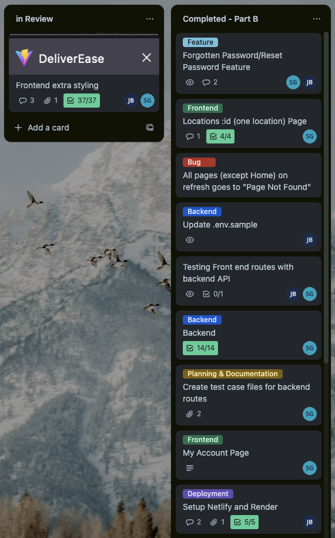
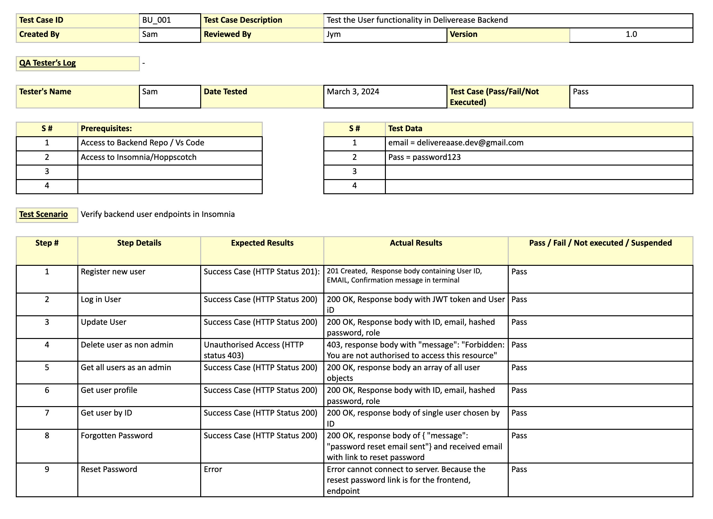

# DeliverEase

## Sam Gifford and Jym Bocala

<br/>

<div align="center">
  
</div>

<br/>

### [Live Site 🔗](https://deliverease.live/)

<br/>

##### Login credentials for sample user:

```
email: deliverease1@gmail.com
password: password1
```

#### **Contents:**

1. [Project Purpose](#Purpose)
2. [Functionality and Features](#Functionality-and-Features)
3. [Target Audience](#Target-Audience)
4. [Tech Stack](#Tech-Stack)
5. [Data Flow Diagram](#Data-Flow-Diagram)
6. [Application Architecture Diagram](#Application-Architecture-Diagram)
7. [User Stories](#User-Stories)
8. [Wireframes](#Wireframes)
   - [Home Page](#Home-Page)
   - [All Locations Page](#All-Locations-Page)
   - [Location-Log](#Location-Log-Page)
9. [Project Management](#Project-Management)

<br/>

#### **Project Links:**

[_• GitHub Repository - Backend_](https://github.com/jymbocala/deliverease-backend)  
[_• GitHub Repository - Frontend_](https://github.com/jymbocala/deliverease-frontend)  
[_• Trello Project Board_](https://trello.com/b/jmxlxfhw/deliverease)

---

### Purpose

DeliverEase is your ultimate solution to streamline and optimize delivery logistics effortlessly. Imagine this scenario: You've recently expanded your delivery services, and now your drivers are navigating through intricate routes, struggling to locate drop-off points efficiently. You could resort to handwritten notes, scattered maps, and endless phone calls to guide them, but wouldn't it be simpler to have everything organized in one place?

DeliverEase is designed to revolutionize the way delivery operations are managed. Our app serves as a centralized platform where users can effortlessly catalog delivery locations, complete with detailed information such as addresses, docking instructions, parking availability, and contact details. No more wasted time and resources as drivers meander through unfamiliar territories or miss crucial delivery deadlines. With DeliverEase, every stop becomes a seamless experience.

Our goal is to simplify delivery logistics, enhance productivity, and ensure customer satisfaction.

<br/>

### Functionality and Features

- Location Management: DeliverEase enables users to effortlessly add, delete, and edit location details, ensuring accurate and up-to-date information for each delivery point.
- Comprehensive Location Details: Users can conveniently view all location details, including addresses, trading hours for docks, parking instructions, contact information, and specific notes for any given location.
- Search Capability: DeliverEase enables users to swiftly find existing database entries by location name, enhancing accessibility and efficiency in navigation.
- Photo Upload Capability: With integrated photo upload functionality, users can easily upload and attach photos of delivery locations, providing visual cues and enhancing navigation for delivery drivers.

<br/>

### Target Audience

DeliverEase is tailored for individuals and businesses involved in delivery services, seeking to streamline their logistical operations and enhance efficiency. The target audience encompasses a diverse range of users, including:

- Courier Companies: Established courier services looking to optimize their delivery routes, minimize time wastage, and improve customer satisfaction.
- Delivery Drivers: Independent delivery drivers seeking a comprehensive tool to navigate through complex delivery routes with ease and precision.
- Small to Medium Businesses: Businesses engaged in B2B and B2C deliveries, aiming to enhance their delivery management processes and ensure timely and accurate deliveries.

<br/>

### Tech Stack

DeliverEase leverages the power of the MERN stack---a comprehensive web development framework--- to streamline delivery management. This stack comprises:

- MongoDB: A flexible NoSQL database for efficient data storage.
- Express: A Node.js web framework for smooth routing and middleware.
- React: A JavaScript library for dynamic front-end development.
- Node.js: Powers our server-side operations and enhances functionality.

Additional technologies we used:

- Mongoose: Facilitates MongoDB object modeling and validation.
- Vitest: Frontend testing library
- Supertest: Express testing library
- HTML and CSS: Foundational for structuring and styling our user interface.
- TailwindCSS: A CSS framework for rapidly building custom designs.
- DaisyUI: A component library built on top of TailwindCSS, providing additional UI components and utilities.

<br/>

---

### Data Flow Diagram

<p align="center">
  
</p>

<br/>

---

### Application Architecture Diagram

<p align="center">
  
</p>

<br/>

---

### User Stories

User Stories serve as concise narratives outlining specific functionalities from an end-user perspective. Through this exercise, our team gained a deeper understanding of DeliverEase's core value and our minimum viable product (MVP) by dissecting user needs and translating them into actionable features.

#### _User stories progress, February 11:_

In the early stages of DeliverEase development, our team collaborated to outline essential user stories. We emphasized crafting clear narratives for user registration, login, and password security. Addressing delivery drivers' needs, we detailed location instructions and contact information for seamless navigation and communication. Additionally, we conceptualized a search and discovery feature for efficient access to logged delivery locations based on specific criteria.

<ins>Registration & Login</ins>

- As a new user, I want to create an account with a secure username and password so that I can access the system's features.
- As a returning user, I want to log in easily with my saved credentials so that I can quickly resume my work.
- As a user, I want to be able to reset my password securely if I forget it so that I can regain access to my account.
- As an administrator, I want to enforce strong password policies so that all user accounts are resistant to unauthorized access.

<ins>Location Management</ins>

- As a delivery driver, I want clear directions and instructions provided for delivery locations, including information about parking, entrance points, and any specific instructions for accessing the location, so that I can ensure smooth delivery of my order.
- As a delivery driver, I want access to contact information for key personnel at delivery locations, so that I can efficiently communicate with them if needed.

<ins>Search and Discovery</ins>

- As a delivery driver, I want to search for specific delivery locations by entering keywords such as address, client name, or location details, so I can easily find the destinations I need to navigate to.
- As a courier company owner, I want to see additional information about delivery locations, such as parking availability, loading dock access, and delivery restrictions, to facilitate smooth and efficient delivery logistics.

#### _User stories progress, February 12:_

We then refined our user stories, we focused on addressing the needs of delivery drivers, our main user base. We defined admin roles and permissions for efficient team management and allowed users to edit their profiles. Additionally, we conceptualized navigation assistance to prevent drivers from getting lost.

<ins>Admin Roles & Permissions</ins>

- As an administrator, I want to create new user accounts for my team members so that they can access the system.
- As an administrator, I want to be able to disable or delete user accounts as needed so that I can manage my team's access effectively.

<ins>Profile Editing</ins>

- As a user, I want to update my profile information (such as name, email, etc.) so that my account reflects my current details.

<ins>Navigation Assistance</ins>

- As a delivery driver, I want access to maps or navigation tools integrated into the application, so that I can easily navigate to delivery locations and avoid getting lost.

#### _User stories progress, February 13:_

In our ongoing refinement process, we were able to identify a wishlist of potential features for DeliverEase. These features represent our aspirations for the app, however it is important to note that these additions will only be implemented if time permits, as we plan on prioritizing core functionalities and user needs first.

- As a user, I want to control my notification preferences so that I receive system updates in the way that works best for me.
- As an administrator, I want to track user activity logs so that I can monitor system usage and identify any suspicious behavior.
- As an administrator, I want to assign different roles and permissions to users so that I can control their access to sensitive information and features.

<br/>

---

### Wireframes

#### _Home Page_

<p align="center">
  
</p>

#### _All Locations Page_

<p align="center">
  
</p>

#### _Location Log Page_

<p align="center">
  
</p>
<p align="center">
  
</p>
<p align="center">
  
</p>

<br/>

---

### Project Management

[_• Trello Project Board_](https://trello.com/b/jmxlxfhw/deliverease)

To optimize our workflow and facilitate progress tracking, our team adopted an Agile methodology supported by the Kanban system implemented through Trello. Trello as our primary project management tool, allowing us to create and track tasks, assign responsibilities, and visualize project milestones. The Kanban system allowed us to streamline our workflow, visualize work in progress, and identify bottlenecks, promoting efficient task management and team collaboration. Alongside Trello, we conducted daily stand-up write-ups and held multiple team meetings. Last to our management system, our GitHub workflow played a crucial role in managing code changes and version control.

Our GitHub process involved each team member working on separate branches that branched off from the main development branch, which was later merged into the main branch. This branching strategy allowed us to work on features and fixes independently while maintaining a clean and stable main branch. Whenever a push was made to a feature branch, we utilized GitHub's pull request mechanism to initiate code reviews, address any conflicts, and ensure the smooth integration of changes into the development branch.

By leveraging these strategies, methodologies, and tools, we fostered effective communication, coordination, and collaboration among team members, enabling us to remain focused, agile, and aligned with our project goals throughout the development lifecycle.

###### Progress: Feb 12 (Day 1)

<p align="center">
  Initial Team Meeting
  
</p>

<p align="center">
  Team standups, February 12
  
</p>

<br>

###### Progress: Feb 14 (Day 3)

<p align="center">
  Team standups, February 14
  
</p>

<p align="center">
  Trello Boards
  
  
  
  
</p>

<p align="center">
  Trello Card - Git Workflow Testing
  
</p>
<p align="center">
  Trello Card - AWS S3 Integration
  
</p>

<p align="center">
  GitHub Pull Request - API
  
</p>

<br/>

---

### Manual Testing Documentation

In our testing approach, we utilized both manual testing and testing frameworks Jest and Supertest. Manual testing enabled hands-on exploration of our system to identify issues and evaluate user experience. Meanwhile, Jest and Supertest provided structured automation for validating API behavior and endpoint functionality.

<p align="center">
  Testing Locations functionality
  
</p>
<p align="center">
  Testing User functionality
  
</p>
<p align="center">
  Update: Testing User functionality
  
</p>
<div align="center">
  <p>
    Testing using SuperTest
  </p>
  
</div>
